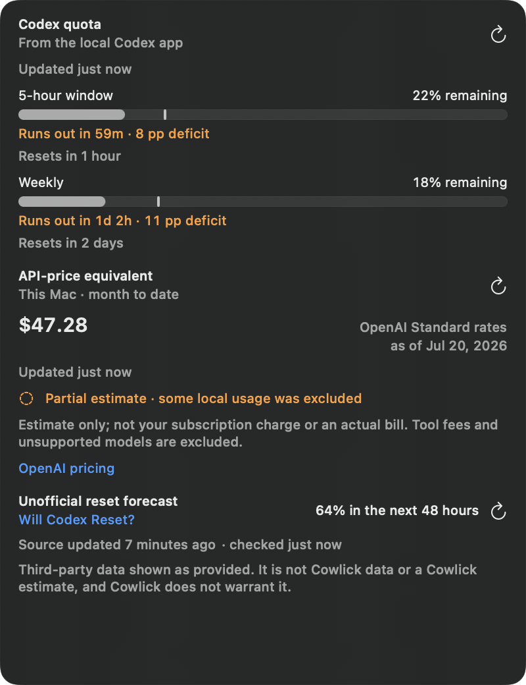

<p align="center"></p>
<h1 align="center">Cowlick</h1>
<p align="center"><strong>Codex status and safe approvals at the MacBook notch. Quota planning in the menu bar.</strong></p>
<p align="center"><a href="https://henryvanness.com/Cowlick">Website</a> · <a href="#install-from-source">Install from source</a> · <a href="docs/security.md">Safety</a> · <a href="docs/privacy.md">Privacy</a></p>
<p align="center">
  <a href="https://github.com/henryvn27/cowlick/actions/workflows/ci.yml"></a>
</p>


_Illustrative top-edge framing using a 2× non-notch display capture. Physical-notch evidence will be recaptured from the final signed candidate before release._

[Watch the 10-second product demo](Assets/Demo/cowlick-demo.mp4) · [Open the press kit](Assets/PressKit/README.md)

> **Release status:** source install only. Cowlick will not publish an unsigned or development-signed download. A public DMG and Homebrew cask will appear after Developer ID signing, notarization, and clean-install verification pass.

Cowlick is a native, local-first macOS companion for OpenAI Codex. It stays out of the way while idle, surfaces active projects and completion near the notch, and lets you allow once or deny supported permission requests without becoming another Codex client.

## Status that fits the moment

- **Working stays compact.** Project, task state, and active-session count sit close to the notch.
- **Approvals open only when needed.** Project, tool, operation, and explicit actions stay together.
- **Completion leaves cleanly.** A brief confirmation appears, then the overlay hides again.
- **Sessions stay separate.** Each Codex session and pending request keeps its own identity.

On a Mac without a notch, Cowlick uses a compact top-center island below the menu bar instead of drawing a fake notch.

## Approval safety

Allow is never the default action. Every decision is matched to the exact pending request UUID. If Cowlick is unavailable, disconnected, timed out, or receives malformed data, it returns no decision and Codex keeps its normal approval UI.

[Read the threat model](docs/security.md)

## Plan usage before reset



The pace marker compares current use with an even spend through reset. Cowlick shows time to empty when the observed pace would exhaust quota early. API-price equivalents, organization billing, and third-party reset forecasts remain clearly labeled and separate from subscription usage.

The image uses deterministic demo fixture data captured on July 20, 2026. Its “Will Codex Reset?” value is third-party data shown for attribution testing; it is not Cowlick data or a Cowlick estimate.

## Install from source

The current install requires macOS 14 or newer, Xcode 16 or newer, Homebrew, and XcodeGen.

```sh
git clone https://github.com/henryvn27/cowlick.git cowlick
cd cowlick
brew install xcodegen
./Scripts/install_local.sh
```

The installer builds Cowlick, places it in `~/Applications`, safely merges the bundled Codex hooks, launches the app, and runs bridge diagnostics. Normal users will not need Xcode once the signed public release exists.

To develop without installing, run `./Scripts/build_and_run.sh --verify`. To remove a source install, run `./Scripts/uninstall_local.sh`; add `--purge` only when you also want to remove local preferences and provider credentials.

## Public download

There is no verified public binary yet. The [Releases page](https://github.com/henryvn27/cowlick/releases) is the source of truth. Cowlick will publish a signed and notarized DMG, update ZIP, checksums, and Homebrew cask only after the release pipeline and clean-install checks pass.

## Supported systems

- macOS 14 Sonoma or newer.
- Apple Silicon and Intel are configured as universal build targets. Each public release records the architectures verified in its release notes and checksums.
- Notched and non-notched Macs, external displays, multiple displays, Spaces, and full-screen auxiliary presentation are supported design targets where macOS permits them. A release claims physical coverage only for the hardware and display configurations named in its release notes; automated geometry tests are not described as physical verification.
- Caps Lock signaling is an optional hardware capability, not a core system requirement. Cowlick keeps it disabled when the native signal test does not pass.

## Privacy

Cowlick has no analytics, cloud backend, Cowlick account, ads, or third-party crash reporter. Sparkle checks only the signed update feed attached to verified GitHub releases; an absent feed cannot become an unsigned update. If you explicitly enable the unofficial reset forecast, Cowlick requests data from willcodexquotareset.com and labels it as third-party data that Cowlick does not estimate or warrant. Organization-billing requests happen only for accounts you add and go directly to that provider. The API-price equivalent reads allowlisted token counters and model names locally; it does not upload them or retain prompt content. Raw lifecycle JSONL buffers are transient: the activity observer does not extract, display, log, or persist prompt, message, command, tool-input, or result payloads, and it makes no network requests. Short Codex chat names are read locally by exact session ID, kept only in memory, and can be turned off; prompt-derived fallback names appear only when prompt previews are enabled. Cowlick does not persist full prompts, commands, quota history, forecast history, billing history, chat names, or session history. See [PRIVACY.md](PRIVACY.md) for every stored file, network path, and permission.

## How it works

Cowlick uses two local activity inputs. An FSEvents observer watches recent JSONL files under `~/.codex/sessions` and extracts only session, turn, project, model, subagent, timestamp, and lifecycle-marker fields. This supplies Working, Completed, Failed, and multiple-session status without requiring hook trust. A separate read-only exact-session lookup can add the short chat name shown by Codex while retaining the project as context. Trusted Codex hooks enrich lifecycle delivery and are the only source Cowlick accepts for synchronous permission requests. Neither local path can create, approve, deny, or infer an approval request.

Codex invokes the bundled `cowlick-hook` helper for `SessionStart`, `UserPromptSubmit`, `PermissionRequest`, `SubagentStart`, `SubagentStop`, and `Stop`. Subagents use their official `agent_id` as a child identity, so concurrent agents stay separate without completing their parent task. The helper sends authenticated, versioned newline-delimited JSON over a private Unix-domain socket. The native app arbitrates independent session state and returns synchronous approval decisions only when the request is still current.

For quota display, Cowlick asks the installed Codex app-server only for `account/rateLimits/read`; it does not read `auth.json` or request account identity. This is the single subscription identity active in the Codex executable Cowlick selects, not a managed multi-login system. The optional API-price equivalent scans local Codex session JSONL for allowlisted model, turn-ID, and numeric token-counter fields. It also reads bounded local `response.create` rows from `~/.codex/logs_2.sqlite` to recognize only exact `service_tier: priority` turns; raw trace bodies are transient and never retained or logged. Cowlick applies a bundled reviewed pricing table and labels unavailable, unsupported, or ambiguous coverage as partial. It excludes tool fees and cannot attribute work to a subscription account. In Settings → Accounts, Add Account accepts separately labeled OpenAI API and Anthropic API organization accounts; the menu can switch and refresh the selected account. Cowlick shows each account's month-to-date charges without aggregating providers or presenting them as Codex subscription usage. OpenAI organization costs are account-wide; Anthropic's official cost report excludes Priority Tier usage, so Cowlick marks Anthropic coverage as partial. The optional reset forecast is fetched separately from `https://www.willcodexquotareset.com/api/forecast`, decoded as untrusted display-only data, and kept in memory.

See [architecture](docs/architecture.md) and the [bridge protocol](docs/protocol.md).

## Development

The project-local Codex Run action uses the same build command. See [CONTRIBUTING.md](CONTRIBUTING.md) for code style, testing, and pull-request guidance.

## Contributing

Read [CONTRIBUTING.md](CONTRIBUTING.md). Security reports belong in a private [GitHub security advisory](https://github.com/henryvn27/cowlick/security/advisories/new), not a public issue.

Cowlick is MIT licensed. It is an unofficial community project and is not affiliated with, endorsed by, or sponsored by OpenAI. OpenAI and Codex are trademarks of their respective owners.
