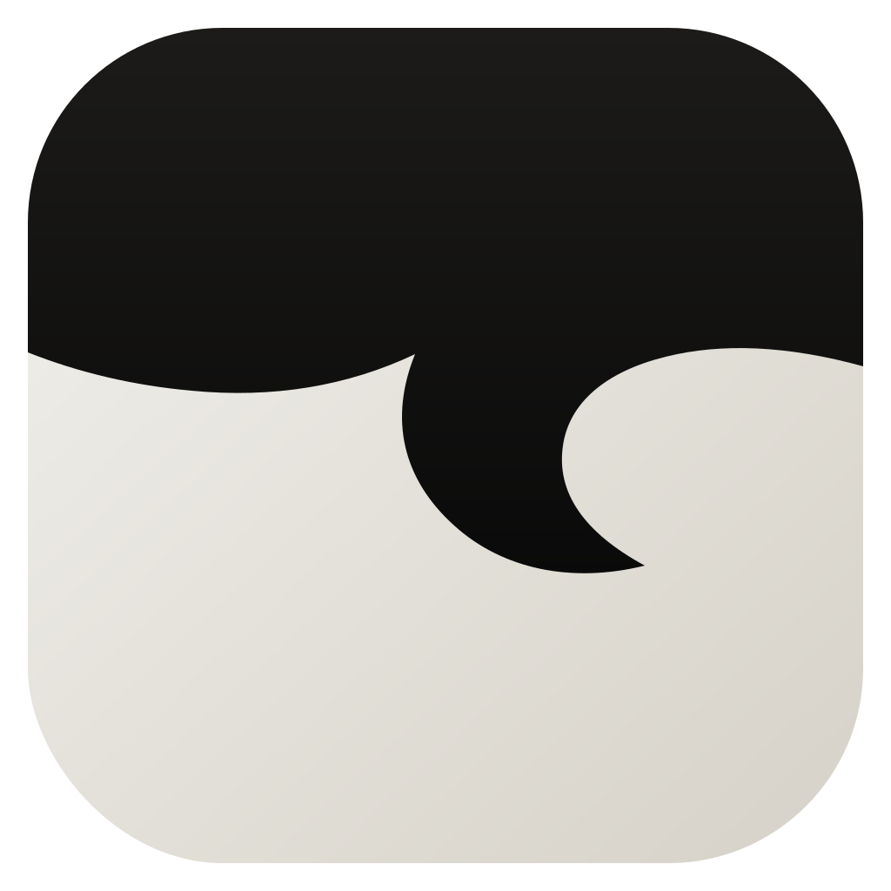
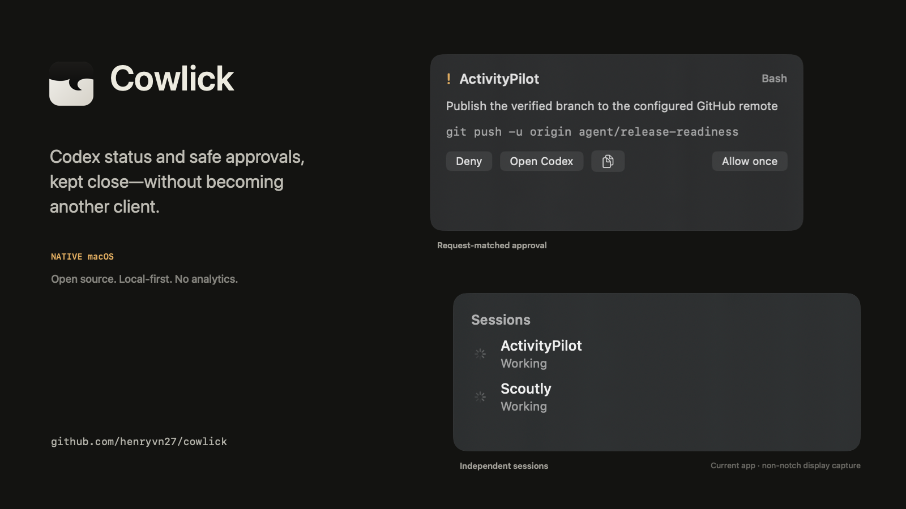

<p align="center"></p>
<h1 align="center">Cowlick</h1>
<p align="center"><strong>Codex status and safe approval actions, right at the MacBook notch.</strong></p>
<p align="center"><a href="#install">Install</a> · <a href="docs/security.md">Security</a> · <a href="docs/privacy.md">Privacy</a> · <a href="docs/troubleshooting.md">Troubleshooting</a></p>
<p align="center">
  <a href="https://github.com/henryvn27/cowlick/releases"></a>
  <a href="https://github.com/henryvn27/cowlick/actions/workflows/ci.yml"></a>
</p>



[Watch the 8-second product demo](Assets/Demo/cowlick-demo.mp4) · [Open the press kit](Assets/PressKit/README.md)

> Cowlick does not publish unsigned or development-signed downloads. The [GitHub Releases page](https://github.com/henryvn27/cowlick/releases) is the source of truth: if it lists no release, use the contributor install rather than an unverified build artifact.

Cowlick is a native, local-first macOS companion for OpenAI Codex. It stays hidden while idle, shows active projects and completion near the notch, and lets you allow once or deny supported Codex permission requests without becoming a second Codex client.

## What it does

- Shows working, approval, completed, and multi-session Codex lifecycle states. Cowlick's failure presentation is reserved for its own bridge and self-test diagnostics; the available Codex hooks do not provide authoritative task-failure state.
- Uses official Codex lifecycle hooks; it does not parse transcripts.
- Matches approval decisions to a unique pending request and never defaults to Allow.
- Falls back to Codex's normal approval UI if the app is unavailable, disconnected, malformed, or timed out.
- Uses the built-in display's real safe-area geometry; non-notch Macs get a compact top-center island.
- Shows current Codex quota from the single local Codex identity, with no account-file access or usage history.
- Estimates whether the current burn rate should last through reset or approximately how long remains before quota exhaustion; it does not present an “expected percent” as the forecast.
- Keeps multiple labeled OpenAI API and Anthropic API organization-billing accounts separate, with an account switcher in the menu, aliases in owner-only metadata, and Admin API keys in macOS Keychain.
- Can optionally display an attributed, unofficial reset forecast from [Will Codex Reset?](https://www.willcodexquotareset.com/); it is off by default and never presented as Cowlick data.
- On supported hardware, optionally pulses the Caps Lock LED while preserving its original state; the feature stays disabled when its in-app signal test cannot verify native control.
- Keeps prompt and result previews off by default.

## Install

### Homebrew

When the [release badge](https://github.com/henryvn27/cowlick/releases) shows a version and the public tap contains the matching cask, install the signed and notarized app with:

```sh
brew install --cask henryvn27/cowlick/cowlick
```

If Homebrew reports that the cask is unavailable, no verified public cask has been published yet. Do not substitute a development build.

### Direct download

Every public version is listed on [GitHub Releases](https://github.com/henryvn27/cowlick/releases) with its signed, notarized DMG, update ZIP, checksums, release notes, supported architectures, and minimum macOS version. A Releases page with no version means there is no public binary to download. Normal release installation requires no Xcode, Swift, Python, Node, npm, Cowlick account, or cloud service.

After Cowlick installs its four lifecycle hooks, Codex may require one security review: open the Codex CLI, run `/hooks`, and trust the Cowlick commands. This is a trust confirmation, not a manual hook-installation step.

To uninstall a public build, first choose Settings → Integration → Remove Integration so Cowlick removes only its hooks and installed helper. Then remove the app with `brew uninstall --cask cowlick` or delete the direct-download app. Before `brew uninstall --zap`, also remove every saved billing account in Settings → Accounts because Homebrew cannot remove its Keychain credential.

### Contributor install

Requirements: macOS 14+, Xcode 16 or newer, and XcodeGen.

```sh
git clone https://github.com/henryvn27/cowlick.git cowlick
cd cowlick
brew install xcodegen
./Scripts/install_local.sh
```

The contributor installer builds Cowlick, installs it in `~/Applications`, installs and merges the local Codex hooks, launches the app, and runs bridge diagnostics. Use `./Scripts/build_and_run.sh --verify` when developing without installing. Contributor builds are not public release artifacts and should not be redistributed as such.

Contributor uninstall preserves preferences, provider accounts, and their Keychain credentials by default. `./Scripts/uninstall_local.sh --purge` first deletes and verifies every referenced provider credential, then removes local data; it stops without deleting account metadata if Keychain cleanup cannot be verified.

## Approval safety

Cowlick's Allow button is never the default action. Every response contains the exact request UUID received from the helper. A timeout, invalid token, stale event, malformed response, mismatched UUID, unavailable app, or broken socket returns no decision, so Codex continues with its own normal approval prompt. Tool input is display-only and is never executed by Cowlick.

## Supported systems

- macOS 14 Sonoma or newer.
- Apple Silicon and Intel are configured as universal build targets. Each public release records the architectures verified in its release notes and checksums.
- Notched and non-notched Macs, external displays, multiple displays, Spaces, and full-screen auxiliary presentation are supported design targets where macOS permits them. A release claims physical coverage only for the hardware and display configurations named in its release notes; automated geometry tests are not described as physical verification.
- Caps Lock signaling is an optional hardware capability, not a core system requirement. Cowlick keeps it disabled when the native signal test does not pass.

## Privacy

Cowlick has no analytics, cloud backend, Cowlick account, ads, or third-party crash reporter. Sparkle checks only the signed update feed attached to verified GitHub releases; an absent feed cannot become an unsigned update. If you explicitly enable the unofficial reset forecast, Cowlick requests data from willcodexquotareset.com and labels it as third-party data that Cowlick does not estimate or warrant. Organization-billing requests happen only for accounts you add and go directly to that provider. Cowlick does not persist full prompts, commands, quota history, forecast history, billing history, or session history. See [PRIVACY.md](PRIVACY.md) for every stored file, network path, and permission.

## How it works

Codex invokes the bundled `cowlick-hook` helper for `SessionStart`, `UserPromptSubmit`, `PermissionRequest`, and `Stop`. The helper sends authenticated, versioned newline-delimited JSON over a private Unix-domain socket. The native app arbitrates independent session state and returns synchronous approval decisions only when the request is still current.

For quota display, Cowlick asks the installed Codex app-server only for `account/rateLimits/read`; it does not read `auth.json` or request account identity. This is the single subscription identity active in the Codex executable Cowlick selects, not a managed multi-login system. In Settings → Accounts, Add Account accepts separately labeled OpenAI API and Anthropic API organization accounts; the menu can switch and refresh the selected account. Cowlick shows each account's month-to-date charges without aggregating providers or presenting them as Codex subscription usage. OpenAI organization costs are account-wide; Anthropic's official cost report excludes Priority Tier usage, so Cowlick marks Anthropic coverage as partial. The optional reset forecast is fetched separately from `https://www.willcodexquotareset.com/api/forecast`, decoded as untrusted display-only data, and kept in memory.

See [architecture](docs/architecture.md) and the [bridge protocol](docs/protocol.md).

## Development

The project-local Codex Run action uses the same build command. See [CONTRIBUTING.md](CONTRIBUTING.md) for code style, testing, and pull-request guidance.

## Contributing

Read [CONTRIBUTING.md](CONTRIBUTING.md). Security reports belong in a private [GitHub security advisory](https://github.com/henryvn27/cowlick/security/advisories/new), not a public issue.

Cowlick is MIT licensed. It is an unofficial community project and is not affiliated with, endorsed by, or sponsored by OpenAI. OpenAI and Codex are trademarks of their respective owners.
