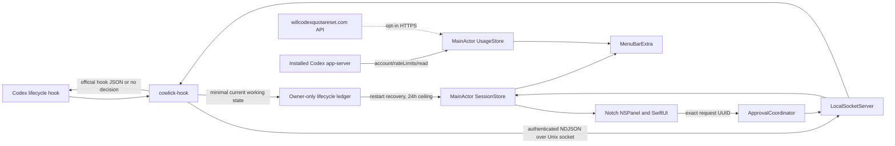

# Architecture

Cowlick is a SwiftUI menu-bar accessory with a narrow AppKit windowing bridge and a Swift command-line helper.

`Models` owns versioned values, session state, and in-memory usage values; `Stores` owns arbitration, preferences, and quota refresh state; `Services` owns IPC, approval, installation, Caps Lock, updates, activation, login, diagnostics, local Codex app-server access, and the optional forecast request; `Windowing` owns safe-area geometry and the tightly bounded panel; `Views` owns presentation and onboarding. The internally named `CowlickHook` target is the standalone decoder and bridge client; its shipped executable is `cowlick-hook`.

All session mutations run on the main actor. Socket work uses a dedicated queue. Project-name resolution runs off-main without a Git subprocess. The overlay is ordered out with no animation loop while idle.

Sessions are keyed by Codex `session_id`. Priority is approval, failed, working, recently completed, idle. Only the first unexpired approval UUID can be decided. Completed sessions leave presentation after the configured interval and are removed after 15 minutes. Before socket delivery, the helper atomically updates a minimal owner-only ledger for working and Stop lifecycle events. Cowlick restores those working entries after an app restart and ignores ledger entries older than 24 hours; prompt and operation content never enters the ledger.

Quota work is outside the hook bridge. `CodexUsageService` starts the installed Codex app-server ephemerally and calls only `account/rateLimits/read`; it never requests account identity or reads Codex authentication files. `ResetForecastService` is reachable only when the user enables the separate forecast preference. Both responses are bounded and held only in `UsageStore` memory. Refreshes are event-driven rather than timer-driven: official quota uses a five-minute freshness interval, ordinary forecast triggers use fifteen minutes, and opening the menu can refresh a forecast older than 30 seconds.
