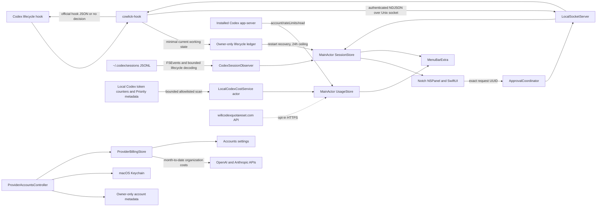

# Architecture

Cowlick is a SwiftUI menu-bar accessory with a narrow AppKit windowing bridge and a Swift command-line helper.

`Models` owns versioned values, session state, and in-memory usage values; `Stores` owns arbitration, preferences, and quota refresh state; `Services` owns IPC, approval, installation, Caps Lock, updates, activation, login, diagnostics, local Codex app-server access, and the optional forecast request; `Windowing` owns safe-area geometry and the tightly bounded panel; `Views` owns presentation and onboarding. The internally named `CowlickHook` target is the standalone decoder and bridge client; its shipped executable is `cowlick-hook`.

All session mutations run on the main actor. Socket work uses a dedicated queue. Project-name resolution runs off-main without a Git subprocess. The overlay is ordered out with no animation loop while idle.

Sessions are keyed by Codex `session_id`. Priority is approval, failed, working, recently completed, idle. Only the first unexpired approval UUID can be decided. Completed sessions leave presentation after the configured interval and are removed after 15 minutes. Before socket delivery, the helper atomically updates a minimal owner-only ledger for working and Stop lifecycle events. Cowlick restores those entries as **unconfirmed after restart** and ignores ledger entries older than 24 hours. Recovered entries appear in session summaries, but do not increment the active count or open the passive island until fresh local observation or a trusted hook confirms them. Prompt and operation content never enters the ledger.

`CodexSessionObserver` runs on a utility queue with no idle polling loop. It watches current Codex session files, performs a bounded initial tail of recently modified records, and incrementally processes appended bytes. It recognizes only session metadata, turn context, and the `task_started`, `task_complete`, and `turn_aborted` lifecycle markers. Locally observed Working state expires after ten minutes without file activity. A trusted hook owns the same session and turn when both paths report it, so observer staleness cannot remove hook-owned state. Local observation is display-only and cannot construct `approvalRequested`.

Quota and billing work are outside the hook bridge. `CodexUsageService` starts the selected installed Codex executable ephemerally and calls only `account/rateLimits/read`; it never requests account identity or reads Codex authentication files. The locator prefers an explicit `COWLICK_CODEX_PATH`, then a running Codex app, installed Codex or ChatGPT app bundles, and finally known CLI locations. Every candidate must be a regular executable that answers a bounded `--version` probe before Cowlick uses it. This represents the single Codex subscription identity already active in that selected installation; Cowlick does not manage or combine Codex subscription logins.

`QuotaPaceCalculator` compares observed use with an even pace through each reset window. After enough time and at least one percent of observed use, it projects a time to empty from the average burn rate. Presentation says whether the quota should last through reset or approximately how long remains before exhaustion; the expected-use percentage remains an internal marker and is not shown as the forecast.

`LocalCodexCostService` is an isolated background actor running at utility priority. It scans only Codex's active and archived local JSONL roots, locates record boundaries in bulk 256 KiB reads, bounds retained records to 1 MiB, and retains only rollout identity, model, timestamp, and numeric token counters. A low-allocation ISO-8601 parser and per-file JSON decoder lifetime keep large cold scans from accumulating Foundation parser storage. Historical files outside the requested interval are skipped. Unchanged files reuse sanitized in-memory aggregates; growing files resume from the last complete-line byte offset instead of rescanning prior content. Repeated totals, active/archive duplicates, fork baselines, and decreasing interleaved counters are contained conservatively; unresolved, ambiguous long-context, or unknown usage is excluded and marks the estimate partial. Pricing uses a reviewed, versioned table of published OpenAI Standard rates. Reasoning is already part of output and is not added twice. Tool fees, account attribution, service tiers, discounts, and actual billing are outside the estimate.

`ProviderAccountsController` manages separately labeled OpenAI API and Anthropic API organization-billing accounts. Aliases and opaque Keychain references are stored in an owner-only versioned metadata file; admin credentials live only in Keychain. Up to four accounts refresh concurrently, while every credential, result, error, and selection remains account-scoped. The menu exposes only the selected account's month-to-date result. Actual organization billing and the local API-price equivalent remain visually and structurally separate; Cowlick does not aggregate either value into subscription usage.

`ResetForecastService` is reachable only when the user enables the separate forecast preference. Usage and forecast responses are bounded and held only in memory. Refreshes are event-driven rather than timer-driven: official quota uses a five-minute freshness interval, ordinary forecast triggers use fifteen minutes, and opening the menu can refresh a forecast older than 30 seconds.
